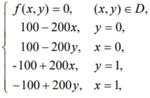

Вычисления произведены для функции из учебника

Я ожидаю, что коэффицент эффиктивности будет расти с размером сетки

Давайте произведем 5 вычилительных экспериментов, в качестве результата рассмотрим среднее аотфметичекое 

|Размер сетки|Время алгоритма Последовательной верссии алгоритма(ms)|Время параллельной верии алгоритма 11.2(ms)| Отношение времени исполнения 11.6(ms)|
|---|---|---|---|
|100|1.44483e+06|4.27411e+06|2.95821|
|200|1.92591e+07|2.16838e+07|1.1259|
|300||||
|400||||
|500||||

Можно сделать вывод, что корректно реализованная версия алгоритма начинает быстрее работать с ростом размера сетки. Выигрыш в скороти наступает лишь с какого-то момента и не пропорционален количеству потоков по причине необходимости взаимодействия потоков. Грубо говоря мы быстрее выполняем определенные блоки программы, но платим за это необходимотью синхронизации, переключения и другого взаимодейтвия потоков. То есть получается некий трейдоф, но если блоки кода которые выполняются параллельно дотаточно большие, то использование параллелизма выгодно. Плата становится ообенно большой, если параллельные вычисления организованы не эффективно, этот эффект ярко отражает инференс алгоритма 11.2, где в связи с неоптимальнотью реализации параллелизма, взаимодейвий между потоками больше, вследвие чего алгоритм работает гораздо медленне последовательной версии.

ОС: Windows 10, процесор: amd ryzen 7 4800h 8 ядер.
