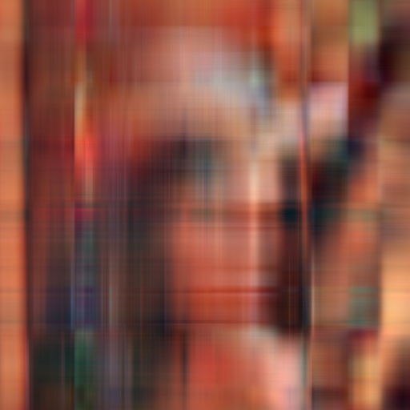
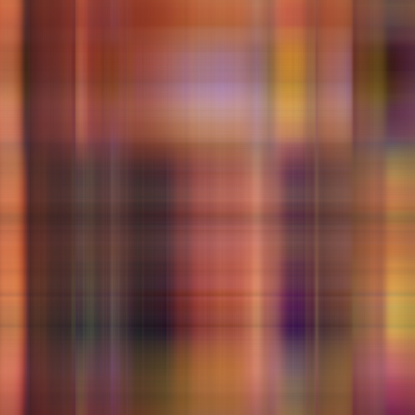
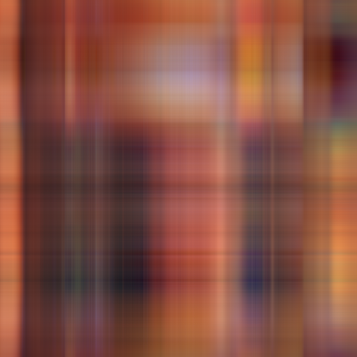
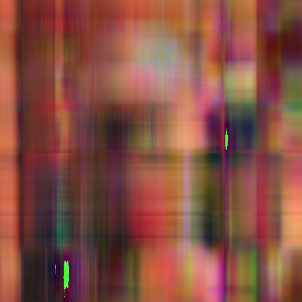
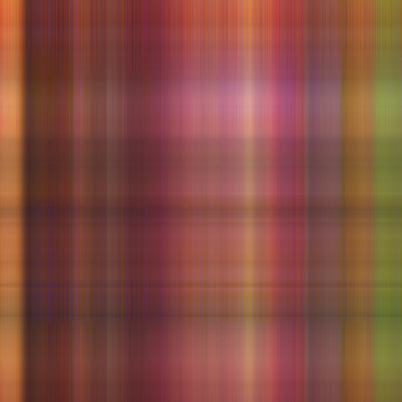

Расмотрим способ сжатия изображения, основанный на SVD разложении. Для самого SVD рассмотрим три реализации \
1) numpy_svd - svd из numpy

2) simple_svd - power iterations method

3) advanced_svd - block power iterations method

Для каждого из способов рассмотрим сжатие исходной картинки в 10, 50 и  100 раз

original

results

| * | 10    | 50    | 100 |
| :---:   | :---: | :---: | :---: |
| numpy_svd |    |    |  |
| simple_svd |    |    |  |
| advanced_svd |    |    |  |

Runtime

| * | 10    | 50    | 100 |
| :---:   | :---: | :---: | :---: |
| numpy_svd(seconds)|  0.05  | 0.06   | 0.05 |
| simple_svd(seconds) |  0.37  | 0.33   | 0.39 |
| advanced_svd(seconds) |  0.33  | 0.25   | 0.26 |

Можно сделать вывод, что при данных параметрах simple_svd работает медленно, но сопостовимо по качеству с реализацией из коробки. advanced же работает быстрее simple, но визуально хуже по качеству.