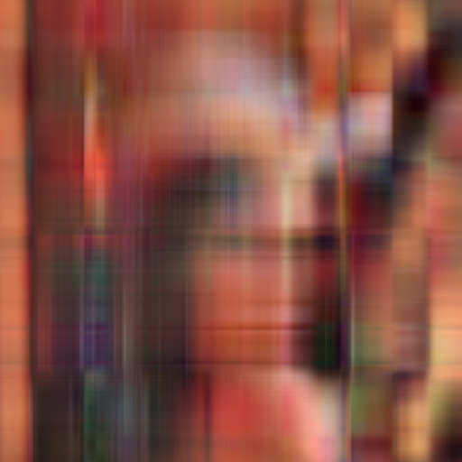

Расмотрим способ сжатия изображения, основанный на SVD разложении. Для самого SVD рассмотрим три реализации \
1) numpy_svd - svd из numpy

2) simple_svd - power iterations method

3) advanced_svd - block power iterations method

Для каждого из способов рассмотрим сжатие исходной картинки в 10, 50 и  100 раз

original

numpy_svd

| * | 10    | 50    | 100 |
| :---:   | :---: | :---: | :---: |
| numpy_svd |    |    |  |
| simple_svd |    |    |  |
| advanced_svd |    |    |  |